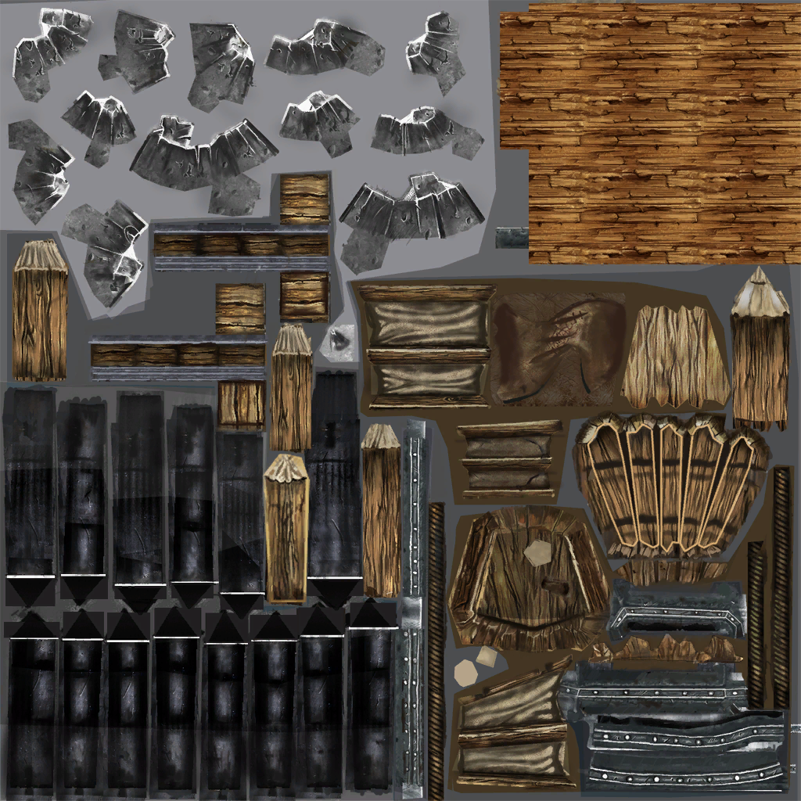

# Style Guide for Battleforge Models #

## Texture Types ##
- Size Limit: None
- Target File Type: DDS
- Source File Type: Everything Blender supports
### Base Color Map ###
This map is the basic UV used for the models texture.
Example:

### Normal Map ###
### Parameter Map
### Environment Map ###
### Refraction Parameter Map ###
### Distortion Parameter Map ###
### Scratch Map ###
### Fluid Map ###
